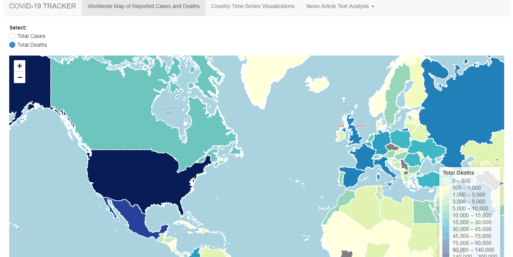
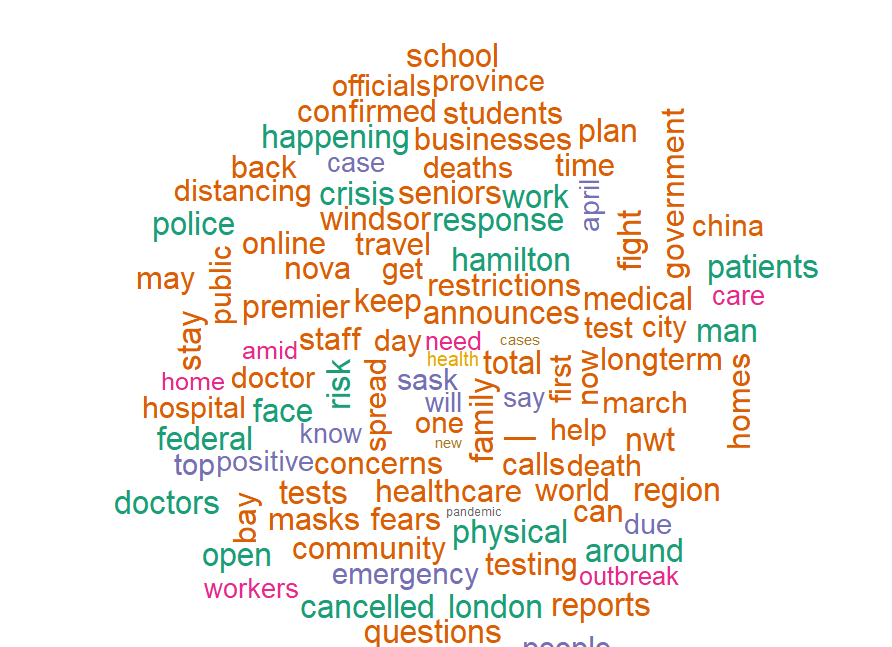

# COVID-19-Tracker

## Running the App

You can launch the app by running:
```
library(shiny)

# Use runGitHub
runGitHub( "COVID-19-Tracker", "lauramurphy12", ref="main")

```
Or you can clone this repository, followed by runApp(). 

```
setwd("~/COVID-19-Tracker")
runApp()
```


## Screenshots





## Acknowledgements

COVID-19-Tracker utilizes [data](https://www.ecdc.europa.eu/en/covid-19/data) reproduced from the European Centre for Disease Prevention and Control in accordance with the [ECDC Copyright and Limited Reproduction Notice](https://www.ecdc.europa.eu/en/copyright). This project utilizes 
[Geojson polygons](https://datahub.io/core/geo-countries) for the world countries reproduced from the [Natural Earth](https://www.naturalearthdata.com/), [Lexman](https://github.com/lexman), and the [Open Knowledge Foundation](https://okfn.org/) in accordance with the [Open Data Commons Public Domain Dedication and License](https://opendatacommons.org/licenses/pddl/1-0/). Lastly, this project uses [data](https://www.kaggle.com/ryanxjhan/cbc-news-coronavirus-articles-march-26) from the "COVID-19 News Articles Open Research Dataset" by Ryan Han licensed under [CC BY-NC-SA 4.0](https://creativecommons.org/licenses/by-nc-sa/4.0/).
